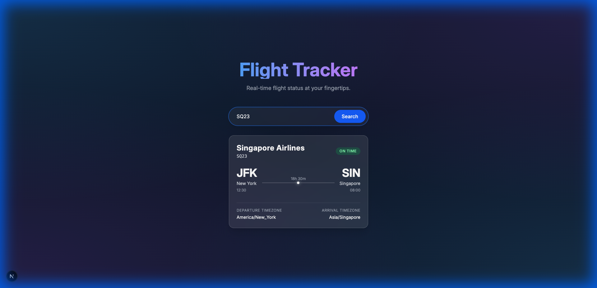

# Flight Tracker

A premium, real-time flight tracking application built with Next.js and Tailwind CSS.



## Features

-   **Real-time Flight Status**: Instant lookup of flight times, terminals, and status (On Time, Delayed, Cancelled).
-   **Premium UI**: Glassmorphism design with smooth animations and a responsive layout.
-   **Dual Data Source**:
    -   **Mock Data**: Comes with a rich dataset of 50+ realistic flights for immediate testing.
    -   **Live API**: Built-in support for [AviationStack](https://aviationstack.com/) (free tier supported).

## Getting Started

### Prerequisites

-   Node.js 18+
-   npm or yarn

### Installation

1.  Clone the repository:
    ```bash
    git clone https://github.com/joblesspoet/flight-tracker.git
    cd flight-tracker
    ```

2.  Install dependencies:
    ```bash
    npm install
    ```

3.  Run the development server:
    ```bash
    npm run dev
    ```

4.  Open [http://localhost:3000](http://localhost:3000) in your browser.

## Configuration

### Using Real Data (Optional)

To use live flight data, obtain a free API key from [AviationStack](https://aviationstack.com/) and add it to your environment variables.

1.  Create a `.env.local` file in the root directory.
2.  Add your key:
    ```env
    AVIATION_STACK_KEY=your_api_key_here
    ```
3.  Restart the server. The app will automatically switch to fetching real data, falling back to mock data if the API limit is reached or the request fails.

## Tech Stack

-   **Framework**: Next.js 15 (App Router)
-   **Styling**: Tailwind CSS v4
-   **Language**: TypeScript
-   **Font**: Inter (Google Fonts)

## Example Flights to Try

If you are running in Mock Data mode, try searching for these flight numbers:

-   **AA100** (New York -> London)
-   **SQ23** (New York -> Singapore)
-   **LH401** (New York -> Frankfurt)
-   **QF12** (Los Angeles -> Sydney)
-   **DL405** (New York -> Paris)
